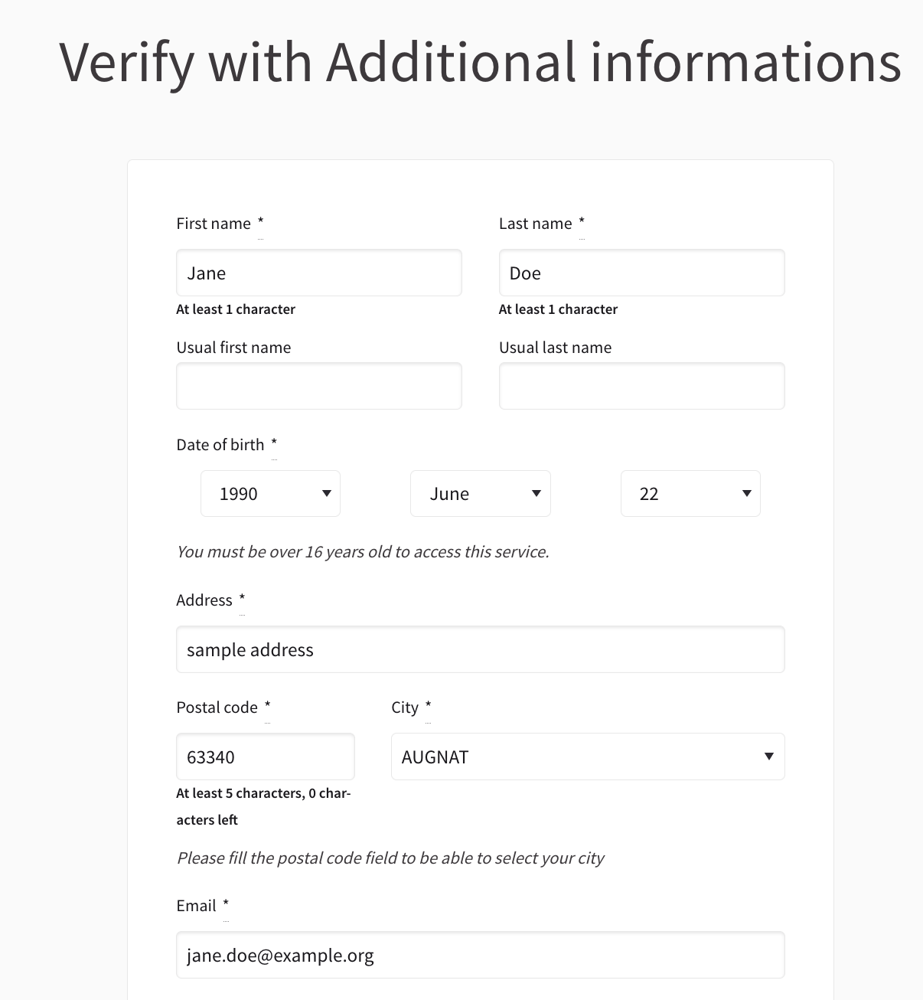

# ExtendedSocioDemographicAuthorizationHandler

This module implements a Decidim Authorization Handler based on Socio Demographic data. User can now be verified using based on several informations : **firstname**, **lastname**, **email**, **zipcode**, **city**, and other fields.

## 📸 Screenshot of AH



## 🚀 Getting started

## Pre-requirements

* A Decidim version `~> 0.27`

_At the moment module is only available for version 0.27_

## Installation

Add this line to your application's Gemfile:

```ruby
gem "decidim-extended_socio_demographic_authorization_handler", git: "https://github.com/OpenSourcePolitics/decidim-module-extended_socio_demographic_authorization_handler.git", branch: "cese"
```

And then execute:

```bash
bundle
```

Now the module should be added to your current Decidim project.

### Using API key or use as anonymous

This module has an autocomplete feature based on zipcode and able to refresh the list with related cities. These cities are found thanks to the [Opendatasoft API](https://help.opendatasoft.com/apis/ods-search-v1/#security).

* You can use the module without API KEY, API allows until 500 requests per day for a same domain.
* You can export the `OPENDATASOFT_API_KEY` environment variable. The API key will increase the daily limit from 500 to 20000. 

When a user type a zipcode, an AJAX request is sent to the `api_controller` and will call a service in charge of external requests. For every zipcode, service will check if the key exists in cache otherwise it performs an API call and store the result in cache. In frontend, AJAX response will be stored in session storage to prevent duplicating ajax requests

### Override the authorization form

You can override the current form for adding or creating specific fields according to your needs. To do so, we will have to override the form partial and the socio_demographic service

First in your decidim project, create a new file `app/views/socio_demographic_authorization/_form.html.erb`. This file contains the form partial visible when user fill the authorization form.

Then, manage the newly created form with the service : `app/services/extended_socio_demographic_authorization_handler.rb`. This file contains the form validations and attributes.

## 👋 Contributing
We are open to any contributions (issues, PR, etc...)

## 🔒 Security
Security is very important to us. If you have any issue regarding security, please disclose the information responsibly by sending an email to **security[at]opensourcepolitics[dot]eu** and not by creating a Github issue.

## License
The decidim-app is licensed under the [AGPLv3](./LICENSE-AGPLV3.txt), same license as Decidim.